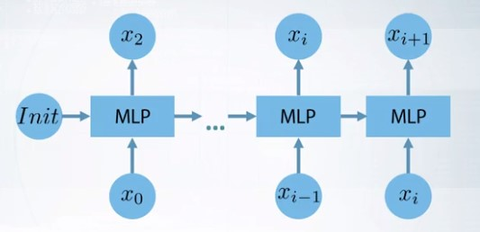

# RNNs
## Whys RNNs
* What is sequential data
* What is language model and its applications
* Problems with using MLP
* Recurrent Architecture

## Simple RNNs and bp
* Loss Function, across time steps
* BP through time
* 
